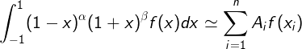
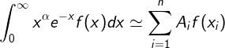
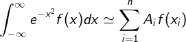

# stroud

Fortran routines for calculating Gaussian quadrature formulas

* [Description](#description)
* [Routines](#routines)
* [Changes](#changes)
* [Example usage](#example-usage)
* [Further reading](#further-reading)

## Description 

This repository contains Fortran routines for calculating Gaussian quadrature formulas originally published in the book by Stroud, A. H. and Secrest, D. (1966). Remarkably, even though these routines are more than 50 years old, they can be easily compiled with a modern Fortran compiler.

The routines use an iterative approach based upon the Newton-Raphson method. Starting from an initial root, the routines calculate approximations of the remaining polynomial roots which are sufficiently good so that the Newton-Raphson method will converge. While the routines were tested extensively by Stroud for a certain number of quadratures, more recent packages such as [IQPACK](https://dl.acm.org/citation.cfm?doid=35078.214351) or [ORTHPOL](https://dl.acm.org/citation.cfm?doid=174603.174605) are likely to be advantageous in terms of stability, accuracy, and calculation speed. 

## Routines

The following routines are included:
* `jacobi` - calculates the roots and weights of the *n*-point Gauss-Jacobi quadrature formula 

* `laguer` - calculates the roots and weights of the *n*-point generalized Gauss-Laguerre quadrature formula

* `hermit` - calculates the roots and weights of the *n*-point Gauss-Hermite quadrature formula

The Jacobi and Laguerre routines require the coefficients of the respective polynomial recursion relations. All routines accept an optional accuracy parameter. The Jacobi and Laguerre routines also offer some basic mechanisms to check the accuracy of the calculations.

## Changes

A compilable version of the original routines from [1] can be obtained with only minor modifications to the print statements. These routines (along with a simple interface module and test program) can be found in the [legacy](/legacy) folder.

While the original routines yield the correct abscissas and weights, the portability, clarity, and accuracy of the code can be improved using features from modern Fortran. For these reasons, we provide also a refactored version of the original routines where
* the source code was converted to free form, 
* the routines were placed in a module and the declaration `implicit none` was used to enforce explicit typing,
* the `intent` attribute was provided for all dummy arguments,
* statement labels were eliminated by using `end do` to terminate all `do`-loops, arithmetic-`if` and `go to` statements were replaced using either `select case()` or `if-elseif-else` branching statements,
* the `gamma` and `flgama` functions were replaced with the compiler intrinsics, `gamma` and `log_gamma`, respectively,

## Example usage

## Further reading
1. Stroud, A. H. and Secrest, D. (1966), Gaussian quadrature formulas, Prentice Hall, Series in Automatic Computation.